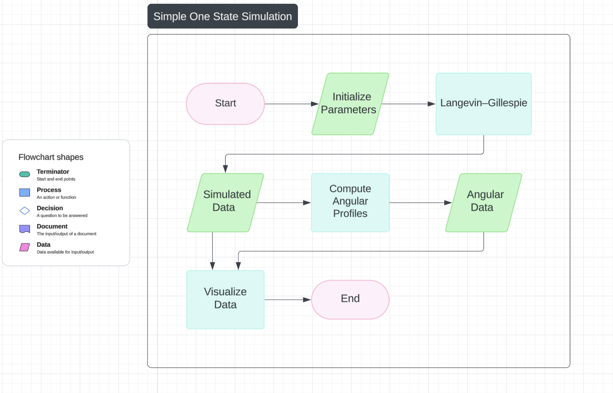
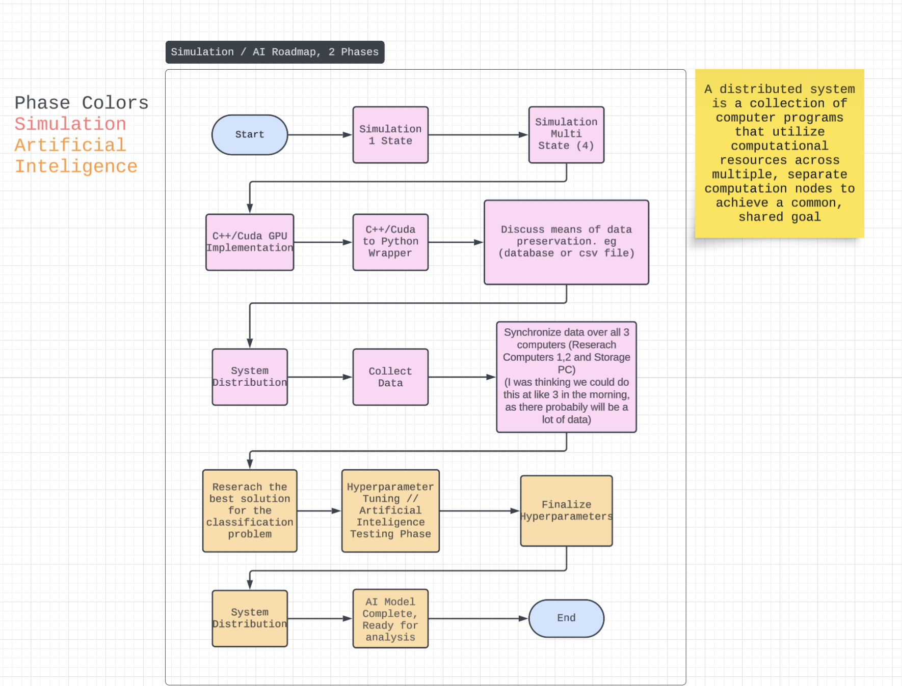

# F1-ATPase Simulation

A Python project that simulates 1D Langevin dynamics using stochastic integration
methods such as Heun, Euler–Maruyama, and a probabilistic approach.
It models rotational dynamics of a particle under the influence of elastic
restoring forces and thermal fluctuations.

---

## Overview

This project can be used to study:

- Rotational motion of a particle or molecular motor (e.g., F1-ATPase)
- Effects of thermal fluctuations on angular dynamics
- Performance of different stochastic integration methods (Heun, Euler, Probabilistic)

The simulation captures how a particle evolves toward an equilibrium position
under both deterministic and stochastic forces.

---

## Project Structure

```
F1-ATPase-simulation/
├── docs/ # Flowcharts, project roadmap, diagrams
├── src/ # Source code
│ ├── core/ # Main simulation classes (LangevinGillespie)
│ ├── utils/ # Helper functions (math, initialization)
│ └── analysis/ # Jupyter notebooks and analysis scripts
├── main.ipynb # Notebook for running simulations and experiments
└── requirements.txt # Python dependencies
```

---

## Setup

Clone the repository:

    git clone https://github.com/RobertAFenn/F1-ATPase-simulation.git
    cd F1-ATPase-simulation

Or, if you prefer, you can download just the simulation class:

    src/core/LangevinGillespie.py

The main.ipynb notebook provides examples on how to use the class, and
all methods are documented inside the Python file.

(Optional) Create a virtual environment:

    python -m venv venv
    source venv/bin/activate   # macOS/Linux
    venv\Scripts\activate      # Windows
    pip install -r requirements.txt

---

## Roadmaps

### Project Flowchart



### Project Roadmap



---

## Usage Example

    from src.utils.compute_transition_matrix import compute_transition_matrix
    from src.core.LangevinGillespie import LangevinGillespie
    import numpy as np

    # Simulation Setup
    LG = LangevinGillespie()
    LG.steps = 2000
    LG.dt = 1e-6
    LG.method = "heun"

    # Mechanical / Thermal Setup
    LG.kappa = 56
    LG.kBT = 4.14
    LG.gammaB = LG.computeGammaB(a=20, r=19, eta=1e-9)

    # Multi State Setup
    LG.theta_states = np.array([3, 36, 72, 116]) * math.pi / 180  # Deg → Rad
    LG.initial_state = 0  # Starting state

    # Transition rate matrix
    LG.transition_matrix = compute_transition_matrix(LG)

    angles, states, thetas = LG.simulate()

LG.simulate() returns a tuple, containing 3 arrays.

bead_positions: bead angles over time
states: discrete states over time
target_thetas: target angles for each step

---

## References

- ["Method to extract multiple states in F1-ATPase rotation experiments from jump distributions"](https://www.pnas.org/doi/10.1073/pnas.1915314116)
- [F1-ATPase_torque_Langevin_simulation](https://github.com/canhochoi/F1-ATPase_torque_Langevin_simulation)
